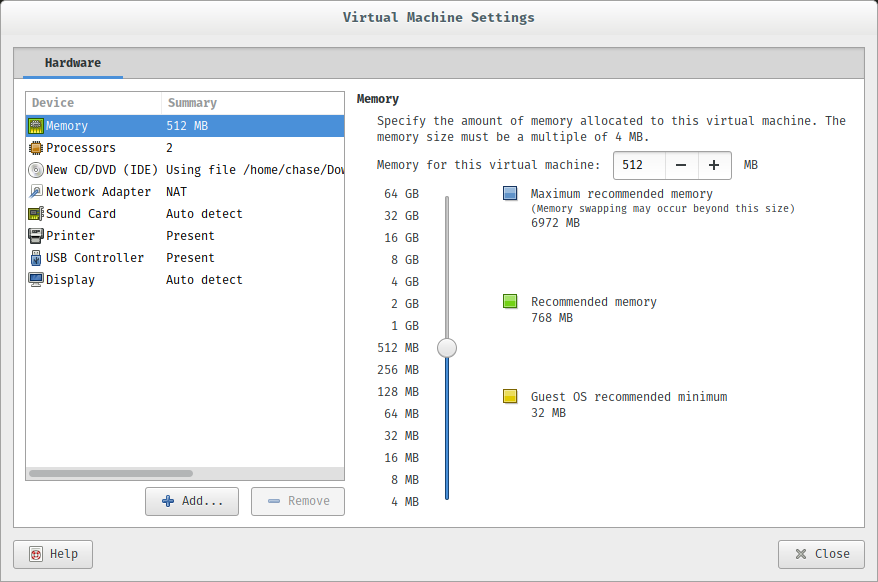

# Installing Arch Linux on VMware Workstation
## Before you begin
To install Workstation Player 14, VMware recommends[@vmwar18] that you have the following:
1. An Intel CPU with VT-x support or an AMD CPU with AMD-V support.
2. 2 GB of RAM (4 GB or higher recommended)
3. A 16- or 32-bit display adapter
4. At least 1 GB of hard drive space

A list of these requirements can be found at the [VMware Docs](ttps://docs.vmware.com/en/VMware-Workstation-Player-for-Linux/14.0/com.vmware.player.linux.using.doc/GUID-3CF87F1D-FD14-4FBA-A00C-F13D65825CA5.html) site.

To install Arch Linux, you must have an x64_86-compatible PC with at least 512MB of RAM and 800 MB of disk space available[@giova18]. Oh, and an active internet connection.

## Getting VMware Workstation Player
To download VMware Workstation Player 14.1, visit [my.vmware.com](https://my.vmware.com/en/web/vmware/free#desktop_end_user_computing/vmware_workstation_player/14_0) and click on the link to download. This will download the file in a `.bundle` package which must be installed from the command line.
To run the installer in Linux, use the command

```
$sudo bash VMware-Player-*.x64_86.bundle
```

After this, an installer window will open asking if you accept their ToS/EULA. It will also ask for a path for system scripts, as well as a product key.

I installed VMware Workstation Player 14.1 on a system already running Arch Linux, and had to install [vmware-patch](https://aur.archlinux.org/packages/vmware-patch/) to get player to detect my kernel.

Next we can get the Arch image.

## Getting Arch Linux

To download the image file for installation, go to the [Arch Linux Download page](https://www.archlinux.org/download/) and select a mirror. (I chose the [cat.pdx.edu](http://mirrors.cat.pdx.edu/archlinux/iso/2018.02.01/) mirror) Alternatively, you can download a torrent and get it from there, but don't forget to seed.

## Setting up your virtual machine
To set up your virtual machine, start VMware Workstation player and hit create a new virtual machine. You will be prompted to chose where to install the operating system from, so hit the "Use ISO image" radio button and point to the Arch .iso you just downloaded. Next, you select "Linux"" and "Other Linux 4.x Kernel" from the dropdown. You'll be prompted to select a location to store your VM and then you will have to chose how big the hard drive you want. I went with the default 8 GB but you can use however much space you would like, provided you have the storage to do so. You can keep the default for virtual disk splitting selected and then hit next.

Finally, you will be brought to a window that says "Ready to Create Virtual Machine", but we aren't. Select "Customize Hardware" and a new window will pop up, shown below:
  
Change the memory to the amount you want (remember, 512 MB is the bare minimum) and set the number of CPU to how many cores your host CPU has (if you are unsure, it's okay to keep the value at 1). You can also click the Display tab and hit "3D Acceleration".

Now you can hit close and finish the setup. Make sure you uncheck the "power on" selector before you finish, there's one more step we need to accomplish before we get into things. Go to the folder that you selected to store your VM and open the `xx.vmx` file with a text editor (Don't double click it!). We're going to add the line
```
firmware = "efi"
```
to the very bottom of the file and then save it.

Now you're ready to power on the system. You can double click the file you just edited, or open it through VMware workstation.

## Installing Arch
Wait until the system loads the operating system splash screen, which will be similar to the one below:


Select `Boot Arch Linux (x64_86)` and wait for the machine to load the installer from the .iso.

You will immediately be put into a command line interface. If this scares you, it shouldn't. I will be here to guide you through the installation.

Type
```
$ ls /sys/firmware/efi/efivars
```
You can use tab completion after the first couple letters of each of the sub folders. If everything is done correctly, you should get an output similar to mine:

  
This means that you have EFI running. This is exactly what we want.

Next, we have to check that we have access to the internet. Type
```
$ ping -c www.google.com
```

If you don't get any errors, you're good to go.

Next, type
```
$ timedatectl set-ntp true
```

This will set the system clock.

### Partitioning your hard disk
The next part will be a little finicky. Type
```
$ lsblk
```

and you will get an output like this:


The drive that we want should be some form of `sdX` where `X` is a letter. In my case, it is `sda`. This is the drive we want to partition. Type

```
$ cfdisk /dev/sda
```

and you will be brought to a partition wizard.

# References
